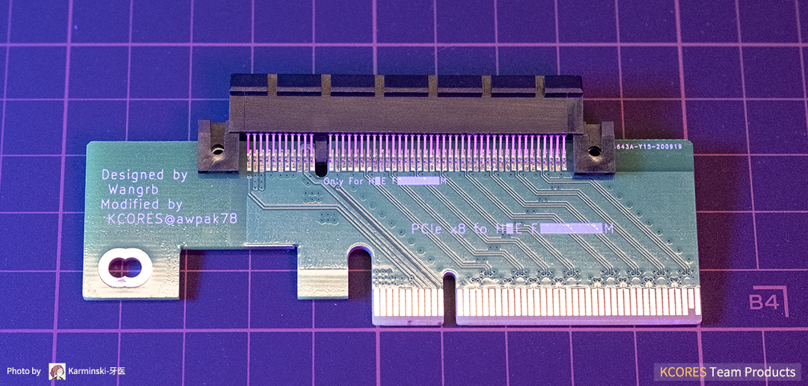
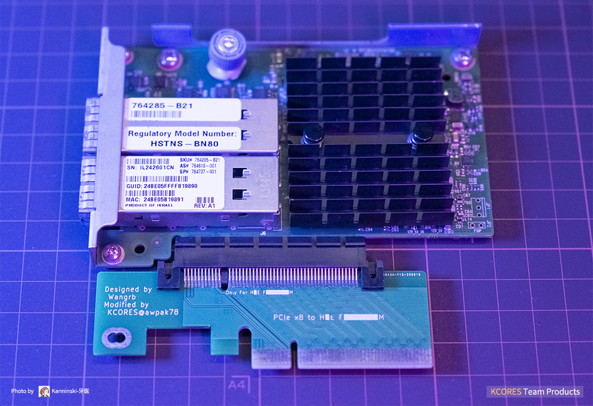
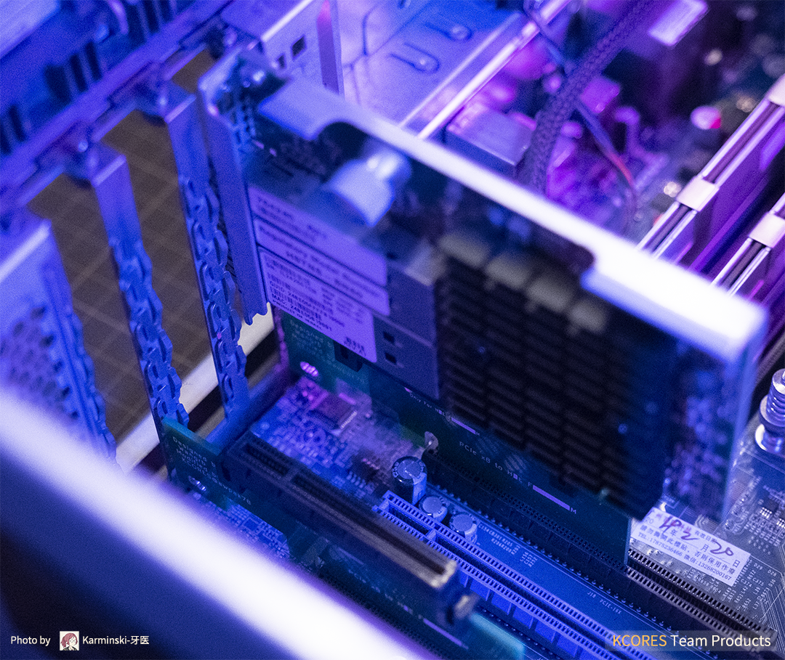
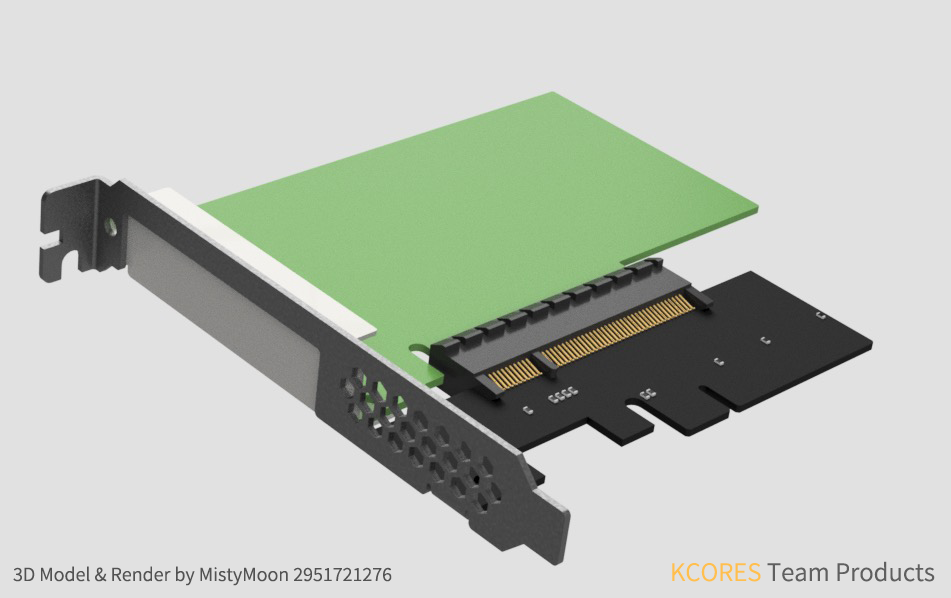
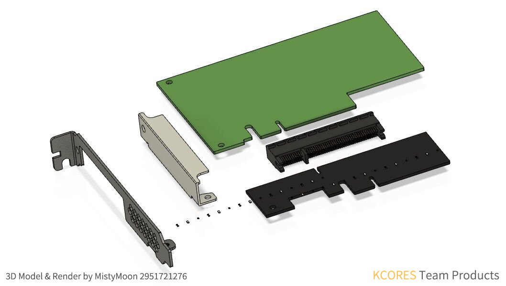

# KCORES-FlexibleLOM-Adapter

KCORES FlexibleLOM to PCIe x8 adapter and baffle model. The FLR series network cards can be used on normal motherboards PCIe slots, including common Gigabit, 10G, and 40G network cards. Due to size limitations, only full-height baffle design is available.  

KCORES FlexibleLOM 转 PCIe x8 转接卡开源设计，可以让普通电脑主板的 PCIe 槽使用 FLR 系列网卡，包括常见的千兆、万兆、40G网卡。由于尺寸限制，只提供全高挡板设计。

- 2 Layers PCB design, Easy to make  
双层PCB设计，容易制造

- Impedance matching by Polar SI9000  
使用 Polar SI9000 计算阻抗

- Small size, Less than 10x10cm  
小尺寸，不超过 10x10cm

# Tested Card

| FlexibleLOM  | NIC Model               | Results |
| ------------ | ----------------------- | :-----: |
| 331FLR       | BCM5719                 | ❌      |
| 366FLR       | intel i350              | ✔      |
| 544FLR-QSFP  | Mellanox ConnectX-3     | ✔      |
| 544+FLR-QSFP | Mellanox ConnectX-3 Pro | ✔      |
| 561FLR-T     | intel X540              | ✔      |

# Photos & 3D Model

# Directory

- /  
KiCAD Project  
KiCAD 工程
  - /doc/  
  documents and images  
  说明文档和配图
  - /Model/  
  Model and baffle designing file  
  模型和挡板设计文件
  - /gerber/  
  The current version of the gerber file  
  当前版本的 gerber 生产文件

# Repo Timeline

1. 2020/10/05  
Introduction and tested card list  
简介和已测网卡列表
2. 2020/10/06  
Model and baffle designing file  
模型和挡板设计
2. 2020/10/09  
KiCAD Project  
KiCAD 工程文件
4. 2020/10/11  
Verified gerber project  
经过验证的 gerber 文件

# Thanks To

- @alphaarea (Main Contributer)
- @MistyMoonR (3D Model)
- @Wangrb (Original Adapter Card Design)
- @Karminski (Photo)