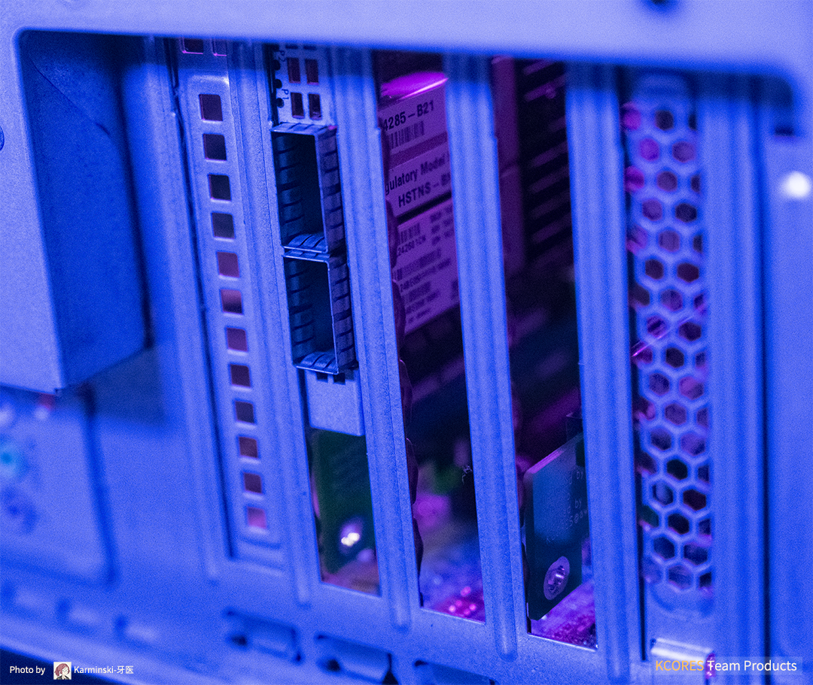
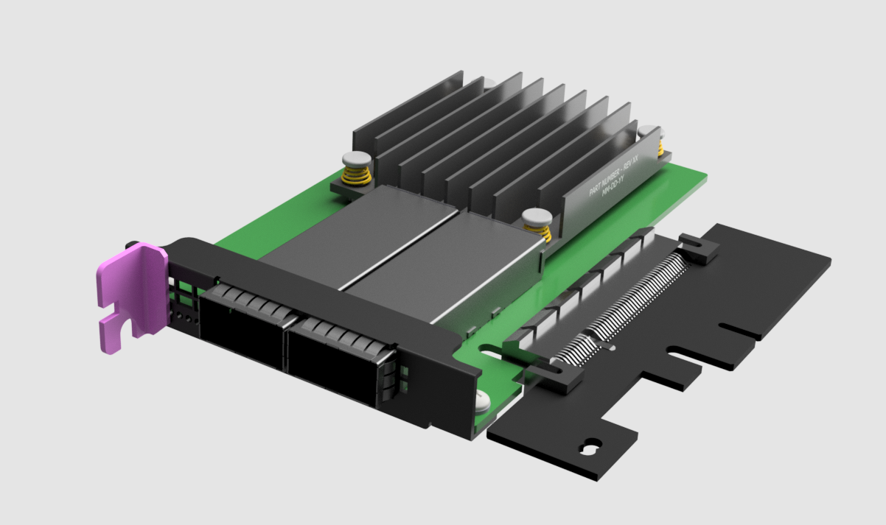

# KCORES-FlexibleLOM-Adapter

  

KCORES FlexibleLOM to PCIe x8 adapter and baffle model. The FLR series network cards can be used on normal motherboards PCIe slots, including common Gigabit, 10G, and 40G network cards. Due to size limitations, only full-height baffle design is available.  

KCORES FlexibleLOM 转 PCIe x8 转接卡开源设计，可以让普通电脑主板的 PCIe 槽使用 FLR 系列网卡，包括常见的千兆、万兆、40G网卡。由于尺寸限制，只提供全高挡板设计。

- 2 Layers PCB design, Easy to make  
双层PCB设计，容易制造

- Impedance matching by Polar SI9000  
使用 Polar SI9000 计算阻抗

- Size less than 10x10cm  
小尺寸，不超过 10x10cm

**[KCORES 官方网站](http://kcores.com/)**

**HomeLab 交流 QQ 群: 826702309**

# Tested FLR List

| FlexibleLOM  | NIC Model               | Connectors        | Results |
| ------------ | ----------------------- | ----------------- | :-----: |
| 331FLR       | BCM5719                 | Quad RJ45 GbE     | ❌     |
| 366FLR       | intel i350              | Quad RJ45 GbE     | ✔      |
| CX3 ALOM     | Mellanox ConnectX-3     | Single SFP+ 10GbE | ✔      |
| 530FLR-SFP+  | BCM57810S               | Dual SFP+ 10GbE   | ❌     |
| 544FLR-QSFP  | Mellanox ConnectX-3     | Dual QSFP+ 40GbE  | ✔      |
| 544+FLR-QSFP | Mellanox ConnectX-3 Pro | Dual QSFP+ 40GbE  | ✔      |
| 560FLR-SFP+  | intel 82599             | Dual SFP+ 10GbE   | ✔      |
| 561FLR-T     | intel X540              | Dual RJ45 10GbE   | ✔      |

- **Note:**  
Some models of 544FLR-QSFP only support 10GbE and QDR. Please check
 the **Part Number** before buying!  
544FLR-QSFP 部分型号只支持 10GbE 和 QDR，请在购买前检查**物料号**！

# Directory

- /Documents/    
说明文档

- /Electricals/  
PCB design files  
3D 模型和挡板设计文件

- /Firmwares/  
Firmwares guide  
固件刷写相关教程

- /Mechanicals/  
FlexibleLOM Model and PCI Baffle  
FLR 卡模型及 PCI 挡板设计文件

# Photos & Renderings

# Thanks To

- [@Wangrb (Original Adapter Card Design)](https://github.com/Wangrb)
- [@AlphaArea (Main Contributer)](https://github.com/alphaarea)
- [@MistyMoonR (3D Model)](https://github.com/MistyMoonR)  
- [@Karminski (Photo)](https://github.com/karminski)
